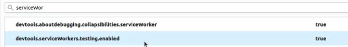

## Env de dev

Pour le serveur, on utilise le framework node Express, mais tout autre solution est viable

    $ docker build -t node/webpush .
Executer en prod, il vous faut faire un inspect pour connaître l'IP et un docker stop pour 
l'arrêter

    $ docker run --rm node/webpush
    
Pour le faire en dev, accecible sur localhost

    $ docker run -p 80:80 --rm --name test-webpush -v `pwd`:/opt/project node/webpush
    
## Pour passer outre sous mozilla

## Déployment Kubernetes

Liste des commandes pour démarrer et arrêter dans container google/cloud-sdk
#### start

    # docker -H 172.17.0.1:2375 push gcr.io/pushweb-292914/push-app:v4
    # kubectl create deployment push-app --image=gcr.io/pushweb-292914/push-app:v4
    # kubectl expose deployment push-app  --name=push-app-service --port 80 --target-port 80 --type=LoadBalancer
#### get IP

    # kubectl get service
    
#### Stop

    # kubectl delete service push-app-service 
    # kubectl delete deployment push-app
    # gcloud container images delete gcr.io/pushweb-292914/push-app:v4
    
